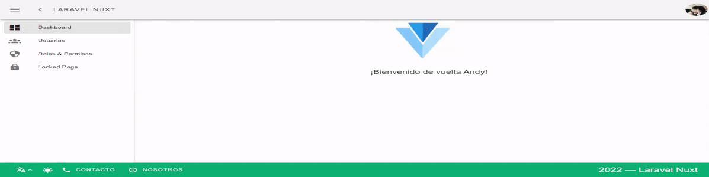

# Laravel-Nuxt

[](https://github.com/andyjoset/laravel-nuxt/actions/workflows/tests.yml)

> A Laravel + Nuxt starter template.

<p align="center">
    
</p>

## Features

- [Laravel 10](https://laravel.com/docs/10.x)
- Laravel [Fortify] + [Sanctum]
- Laravel Permission from [Spatie](https://spatie.be/docs/laravel-permission)
- [Nuxt 2](https://nuxtjs.org/)
- SPA (default) or SSR
- [Nuxt modules:](https://modules.nuxtjs.org/)
    - Vuetify
    - Router
    - Axios
    - I18n
    - ESlint
- [VForm] + [Sweetalert 2] + [Material Design Icons]
- Authentication:
    - Register
    - Login
    - Email verification (disabled by default)
    - Password Reset
    - Password Confirmation
- UI Management:
	- Profile
    - Users
    - Roles

## Installation

- Clone this project
- Copy `.env.example` to `.env` and set your variables
- Run `composer install` and `npm install`
- Run `php artisan key:generate && php artisan migrate`

## Usage

### Email Verification

To enable email verification make sure that your `App\Models\User` model implements the `Illuminate\Contracts\Auth\MustVerifyEmail` contract and the `Features::emailVerification()` in `config/fortify.php` is uncommented.

Visit the [Fortify Docs](https://laravel.com/docs/10.x/fortify#fortify-features) for more info.

### Lang Switcher

Lang switcher is not rendered by default, to enable it set `MULTI_LANG=true` in `.env`

You can set the default lang by setting `DEFAULT_LOCALE=es`

### CSRF Protection

To use cookie based sessions make sure that your client and backend are on the same domain in `.env`:
- Set `SESSION_DOMAIN=.domain.com`
- Set `SANCTUM_STATEFUL_DOMAINS=domain.com`

For more details read the [Sanctum Docs][Sanctum].

### Development

```bash
# start Laravel
php artisan serve

# start Nuxt
npm run dev
```

Open your browser and navigate to `http://localhost:3000`

## Deployment

### SPA

```bash
npm run build
```

### Enable SSR

- Edit `client/nuxt.config.js`:
    - Set `ssr: true` 
    - Comment `nuxtClientInit` plugin
- Edit `.env` variables:
    - Set `APP_URL=http://api.domain.com`
    - Set `SPA_URL=http://domain.com`
- Build client with `npm run build` and `npm run start`

### Server Configuration

To serve your app with Nginx as a reverse proxy and process manager see the [nginx] and [pm2] nuxt examples.

See the [Nuxt Docs](https://nuxtjs.org/deployments) for more deployment examples.

## Notes

- If you prefer your client and Laravel backend in its own project folder you can move the `package.json` into `client/` and copy the `.env` into `client/.env`. Also make sure to update the scripts section in `package.json` and remove the path option:
```
"scripts": {
    "dev": "nuxt",
    "build": "nuxt build",
    "start": "nuxt start",
    "generate": "nuxt generate",
    "lint": "npm run lint:js",
    "lint:js": "eslint --ext .js,.vue",
    "lint:fix": "eslint --fix --ext .js,.vue"
}
```
- The project comes with auto detection for cookie or token (api) authentication based on the domain of the client and the backend, so if your going to use SSR benefits and your client and backend are under the same domain like `myapp.com` and `api.myapp.com` it is recommended to disable the `routes/auth.api.php` by commenting out the `require __DIR__.'/auth.api.php';` in `routes/api.php` but if your app will support web and mobile apps, this is not necessary.
- The project simulates the "remember me" functionality when using API tokens by caching the tokens to determine if it is still valid even if the token has expired. You can change this behavior by editing the `Sanctum::authenticateAccessTokensUsing` in `app/Providers/AuthServiceProvider.php` and the `getExpirationDateAttribute` getter in `App\Models\PersonalAccessToken` model.

## Changelog

For a summary of the most recent changes, please see [CHANGELOG](CHANGELOG.md).

[Fortify]: https://laravel.com/docs/10.x/fortify
[Sanctum]: https://laravel.com/docs/10.x/sanctum
[VForm]: https://vform.vercel.app/
[Sweetalert 2]: https://sweetalert2.github.io/
[Material Design Icons]: https://materialdesignicons.com/
[nginx]: https://nuxtjs.org/deployments/nginx
[pm2]: https://nuxtjs.org/deployments/pm2
